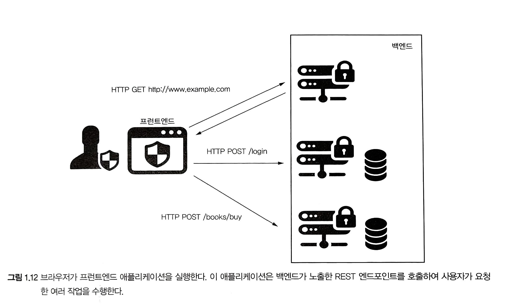

# 오늘날의 보안

> 스프링 시큐리티의 개념과 보안 취약성에 대해 알아보자

**스프링 시큐리티는 애플리케이션에 보안(인증, 인가)을 쉽게 적용할 수 있게 도와주는 프레임워크** 

 

 

## 웹 애플리케이션의 일반적인 보안 취약성

[owasp]: https://maddevs.io/blog/web-security-an-overview-of-sop-cors-and-csrf/

: 오픈소스 웹 애플리케이션 보안 프로젝트

 

#### 일반적인 취약성 목록

- **인증 취약성**
  - 사용자가 악의를 가지고 다른 사람의 기능이나 데이터 접근할 수 있다는 의미
- **세션 고정**
  - 웹 애플리케이션 인증 프로세스 중에 고유한 세션ID를 할당하지 않아 발생
- **xss(교차 사이트 스크립팅)**
  - 서버에 노출된 웹 서비스로 클라이언트 쪽 스크립트를 다른 사용자가 이를 실행하도록 하는 공격
- **csrf(사이트 간 요청 위조)**
  - 서버에서 작업을 호출하는 URL을 추출해 애플리케이션 외부에서 재사용할 수 있다면 발생한다.
- **주입 취약성**
  - 시스템에 특정 데이터를 유입하는 취약성을 이용해 공격

- **기밀 데이터 접급**
- **메서드 접근 제어 부족**
- **알려진 취약성이 있는 종속성 이용**

 

 

## 다양한 아키텍쳐에 적용된 보안

#### 일체형 웹 어플리케이션 설계

 

#### 백엔드 프런트 분리를 위한 보안 설계

