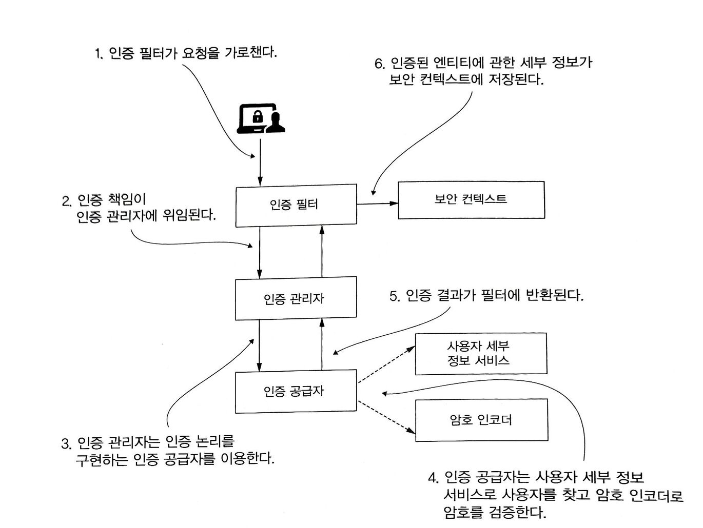

# 안녕! 스프링 시큐리티

> 스프링 시큐리티의 구성요소 설계를 간단하게 살펴보고 구성요소를 설정하는 방법에 대해 배운다.

<br/>

<br/>

## 기본구성



1. 인증 필터는 인증 요청을 인증 관리자에게 위임하고 응답을 바탕으로 보안 컨텍스트를 구성한다.
2. 인증 관리자는 인증 공급자를 이용해 인증을 처리한다.
3. 인증 공급자는 인증 논리를 구현한다.
4. 인증 공급자는 사용자 관리 책임을 구현하는 사용자 세부 정보 서비스를 인증 논리에 이용한다.
5. 인증 공급자는 암호 관리를 구현하는 암호 인코더를 인증 논리에 이용한다.
6. 보안 컨텍스트는 인증 프로세스 후 인증 데이터를 유지한다.

<br/>

#### 기본구성에 대해 알아보자

- **UserDetailsService** (사용자 세부 정보 서비스)
  - 사용자를 검색한다.

- **PasswordEncoder** (암호 인코더)
  - 암호를 인코딩한다.
  - 암호가 기존 인코딩과 일치하는지 확인한다.
- **AuthenticationProvider** (인증 공급자)
  - 인증논리를 정의하고 사용자와 암호의 관리를 위임한다.

<br/>

<br/>

## 기본 구성 재정의

<br/>

#### UserDetailsService 구성 요소 재정의

```java
@Configuration
public class ProjectConfig {

  @Bean
  public UserDetailsService userDetailsService() {
    var userDetailsService = new InMemoryUserDetailsManager();

    var user = User.withUsername("john")
            .password("12345")
            .authorities("read")
            .build();

    userDetailsService.createUser(user);

    return userDetailsService;
  }

  @Bean
  public PasswordEncoder passwordEncoder() {
    return NoOpPasswordEncoder.getInstance();
  }
}
```

<br/>

#### 엔드포인트 권한 부여 구성 재정의

책에서는 WebSecurityConfigurerAdapter를 사용해서 구성을 재정의 하였지만 Spring Security 5.7.0-M2 부터 WebSecurityConfigurerAdapter가 deprecated 됨으로써 [링크](https://spring.io/blog/2022/02/21/spring-security-without-the-websecurityconfigureradapter) 이 방식을 사용한다.

**팁 : 하나의 구성 클래스만 사용하는것보다 구성 클래스의 책임을 분리하여 여러개의 구성 클래스를 사용하는것이 좋다.**

