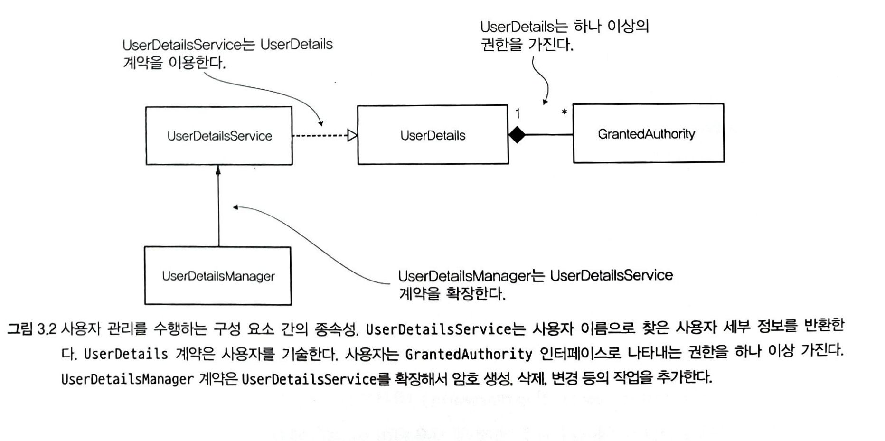
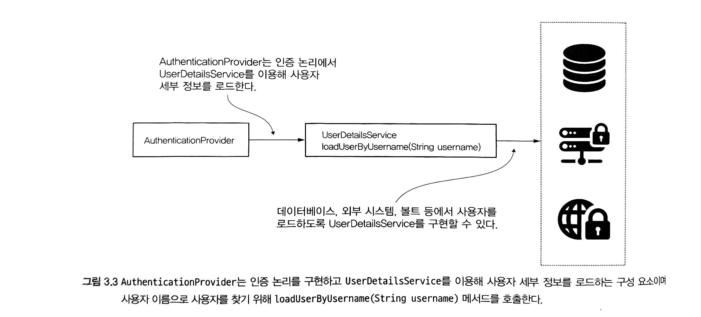
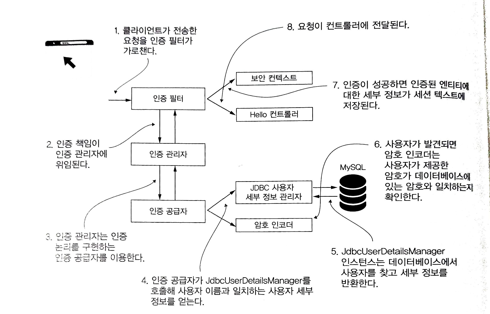

# 사용자 관리

#### 배우는 내용

- 스프링 시큐리티에서 사용자를 기술하는 UserDetails
- 사용자의 권한을 정의하는 GrantedAuthority
- UserDetailsService 계약을 확장하는 UserDetailsManager
- 스프링 시큐리티에 있는 구현과 이를 이용하는 방법
- 계약을 위한 맞춤형 구현을 정의하는 방법과 시기
- 실제 애플리케이션에서 볼 수 있는 인터페이스를 구현하는 방법
- 이러한 인터페이스 이용의 모범 사례

<br/>

<br/>

## 스프링 시큐리티의 인증 구현

사용자 관리를 위해서는 UserDetailsService 및 UserDetailsManager 인터페이스를 이용한다.

- **UserDetailsService**: 사용자 이름으로 사용자를 검색하는 역할만 제공
- **UserDetailsManager**: 사용자 검색뿐만 아닌 사용자 추가, 수정, 삭제 작업을 추가로 제공

이렇게 두개의 인터페이스를 나눈이유는 앱에 필요없는 동작을 구현하도록 강제하지 않기 위해서다 -> **인터페이스 분리 원칙**

<br/>

#### 사용자 관리를 수행하는 구성 요소 간의 종속성

<br/>

<br/>

## 사용자 정의하기

스프링 시큐리티에서 사용자 정의는 UserDetails 계약을 준수해야 한다. UserDetails 계약은 스프링 시큐리티가 이해하는 방식으로 나타낸다.

 애플리케이션에서 사용자를 정의하는 클래스는 프레임워크가 이해할 수 있도록 이 인터페이스를 구현해야한다.

<br/>

#### UserDetails 인터페이스

```java
public interface UserDetails extends Serializable {
  
	String getPassword(); //사용자의 자격증명을 반환
	String getUsername();  //사용자의 자격증명을 반환
  Collection<? extends GrantedAuthority> getAuthorities(); //사용자의 권한을 반환
	boolean isAccountNonExpired();  //계정만료
	boolean isAccountNonLocked();  //계정 잠금
	boolean isCredentialsNonExpired();  //자격 증명 만료
	boolean isEnabled(); //계정 비활성화
}
```

#### UserDetails 인터페이스 구현

```java
public class SimpleUser implements UserDetails {
    
  private final String username;
  private final String password;
    
  public SimpleUser(String username, String password) {
    this.username = username;
    this.password = password;
  }

  @Override
  public String getUsername() {
    return this.username;
  }

  @Override
  public String getPassword() {
    return this.password;
  }
    
  // 생략
  //계정만료, 계정 장금,  자격 증명 만료, 계정 비활성화는 사용하지 않을 경우 true 를 반환하게 오버라이딩 하면된다.

}
```

####  빌더를 사용한 UserDetails 인스턴스 만들기

```java
UserDetails u = User.withUsername("bill")
  							.password("12345")
  							.authorities("read", "write")
  							.accountExpired(false)
  							.disabled(true)
  							.build()
```

<br/>

##### 주의사항

**테이블에 매핑하는 엔티티 클래스가 스프링 시큐리티의 사용자의 세부정보를 위한 계약까지 구현 하면 안된다**. 왜냐하면 이럴경우 하나의 클래스가 두개의 책임을 가지고 있기 때문이다. 애플리케이션의 유지 관리성을 높이려면 책임을 최대한 분리해야된다.

<br/>

<br/>

## 사용자를 관리하는 방법 지정

> UserDetailsService 와 UserDetailsManager 계약을 이해하고 구현함으로써 사용자를 관리하는 방식을 배운다.

<br/>

#### UserDetailsService 인터페이스

UserDetailsService는 주어진 사용자 이름을 통해 사용자 세부 정보를 얻는 하나의 메소드만 가지고 있다. 사용자의 이름을 고유하다고 가정한다.

```java
public interface UserDetailsService {

	UserDetails loadUserByUsername(String username) throws UsernameNotFoundException;

}
```



#### UserDetailsService 구현

```java
public class InMemoryUserDetailsService implements UserDetailsService {

  private final List<UserDetails> users;

  public InMemoryUserDetailsService(List<UserDetails> users) {
    this.users = users;
  }

  @Override
  public UserDetails loadUserByUsername(String username) 
    throws UsernameNotFoundException {
    
    return users.stream()
      .filter(
         u -> u.getUsername().equals(username)
      )    
      .findFirst()
      .orElseThrow(
        () -> new UsernameNotFoundException("User not found")
      );    
   }
}
```

<br/>

#### UserDetailsManager 인터페이스

UserDetailsManager는 UserDetailsService를 확장하고 사용자관리 할수있게 유저를 추가하거나 삭제하는 메소드들이 추가되었다.

```java
public interface UserDetailsManager extends UserDetailsService {
  void createUser(UserDetails user);
  void updateUser(UserDetails user);
  void deleteUser(String username);
  void changePassword(String oldPassword, String newPassword);
  boolean userExists(String username);
}
```

##### UserDetailsManager 구현 클래스

- InMemoryUserDetailsManager : 인메모리 map 을 통한 구현이다. 테스트 및 데모 목적으로 주로 사용된다..
- JdbcUserDetailsManager : sql 데이터베이스에 저장된 사용자를 관리하며 JDBC를 통해 데이터베이스에 직접 연결한다.

<br/>

#### 사용자 관리에 JdbcUserDetailsManager 이용



#### JdbcUserDetailsManager 구현

```java
@Bean
public UserDetailsService userDetailsService(DataSource dataSource) {
  String usersByUsernameQuery = 
     "select username, password, enabled
      ➥ from users where username = ?";
  String authsByUserQuery =
     "select username, authority
      ➥ from spring.authorities where username = ?";
      
      var userDetailsManager = new JdbcUserDetailsManager(dataSource);
      userDetailsManager.setUsersByUsernameQuery(usersByUsernameQuery);
      userDetailsManager.setAuthoritiesByUsernameQuery(authsByUserQuery);
      return userDetailsManager;
}
```

