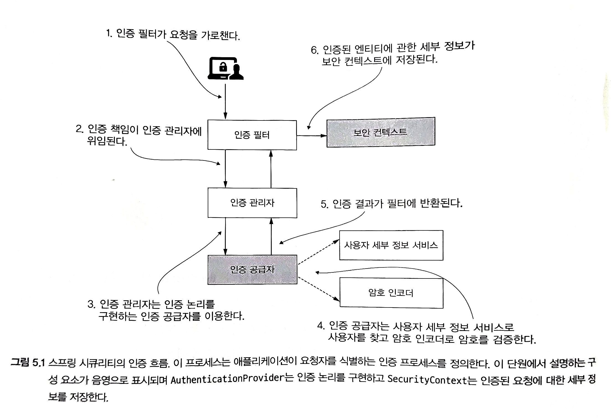

# 인증 구현

#### 배우는 내용

- 맞춤형 Authenticationprovider로 인증 논리 구현
- HTTP Basic 및 양식 기반 로그인 인증 메소드 인용
- ScurityContext 구성 요소의 이해 및 관리

<br/>

이 단원에서는 가능한 결과가 단 두가지인 인증 프로세스를 살펴본다.

- **요청하는 엔티티가 인증되지 않는 경우** -> 클라이언트에게 401권한 없음 응답 상태값 반환
- **요청하는 엔티티가 인증된 경우** -> 요청자의 세부 정보 SecurityContext 에 저장

<br/>

<br/>

<br/>

## AuthenticationProvider의 이해 

> 엔터프라이즈 애플리케이션에는 인증시 다양한 시나리오(지문, 암호, 문자)가 존재한다. AuthenticationProvider인터페이스를 통해 모든 맞춤형 인증논리를 정의할 수 있다.

<br/>

#### Authentication 인터페이스


Authentication 인터페이스는 인증 요청 이벤트를 나타내며 애플리케이션에 접근을 요청한 엔티티의 세부정보를 담는다.

```java
public interface Authentication extends Principal, Serializable {

  Collection<? extends GrantedAuthority> getAuthorities();  //인증된 요청에 허가된 권한의 컬렉션 반환
  Object getCredentials();  //인증 프로세에 이용된 암호나 비밀을 반환
  Object getDetails();
  Object getPrincipal();
  boolean isAuthenticated(); //인증 프로세스가 끝나면 true 진행중이면 false를 반환
  void setAuthenticated(boolean isAuthenticated) 
     throws IllegalArgumentException;
}
```

<br/>

#### AuthenticationProvider 인터페이스

```java
public interface AuthenticationProvider {

  Authentication authenticate(Authentication authentication) 
    throws AuthenticationException;

  boolean supports(Class<?> authentication);
}
```

##### authenticate 구현 방법

- 인증이 실패하면 AuthenticationException을 투척한다.
- AuthenticationProvider 구현에서 지원되지 않는 인증객체를 받으면 null을 반환해야 한다.
- 메서드는 완전히 인증된 객체를 나타내는 Authentication 인스턴스를 반환해야 한다. 

##### supports 구현 방법

- `AuthenticationProvider`가  `Authentication` 객체로 제공된 형식을 지원하면 true를 반환하도록 구현한다.

- supports() 메소드가 true를 반환해도 authenticate() 메소드가 null을 반환해 요청을 거부할 수 있다.
  - 어떤 유형인지는 알겠지만 처리를 할수없는 경우

<br/>

#### AuthenticationProvider 구현 방법 (맞춤형 인증 논리 적용 방법)

1. `AuthenticationProvider` 계약을 구현하는 클래스를 선언한다.
2. 새 `AuthenticationProvider`가 어떤 종류의 `Authentication` 객체를 지원할지 결정한다.
   - 정의하는 `AuthenticationProvider`가 지원하는 인증 유형을 나타내도록 supports() 메소드를 재정의 한다.
   - authenticate() 메소드를 재정의해 인증 논리를 구현한다.
1. 새 `AuthenticationProvider` 구현의 인스턴스를 스프링 시큐리티에 등록한다.

<br/>

#### AuthenticationProvider 구현

```java
@Component
public class CustomAuthenticationProvider 
  implements AuthenticationProvider {

  @Autowired
  private UserDetailsService userDetailsService;

  @Autowired
  private PasswordEncoder passwordEncoder;

  @Override
  public Authentication authenticate(Authentication authentication) {
    String username = authentication.getName();
    String password = authentication.getCredentials().toString();

    UserDetails u = userDetailsService.loadUserByUsername(username);

    //암호가 일치하면 필요한 세부 정보가 포함된 Authentication 계약을 구현한다.
    if (passwordEncoder.matches(password, u.getPassword())) {
      return new UsernamePasswordAuthenticationToken(
            username, 
            password, 
            u.getAuthorities());
    } //암호가 일치하지 않으면 AuthenticationException 예외를 투척한다.
    else {
      throw new BadCredentialsException
                  ("Something went wrong!");
    }
  }

  @Override
  public boolean supports(Class<?> authenticationType) {
    return authenticationType
            .equals(UsernamePasswordAuthenticationToken.class);
  }
}
```

<br/>

##### AuthenticationProvider 다이어그램


<br/>

<br/>

