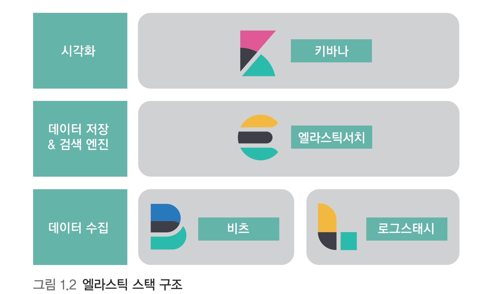

# 엘라스틱 스택이란

> 엘라스틱의 변천사와 엘라스틱 스택의 구성요소, 엘라스틱 스택을 활용한 전문 검색 서비스, 로그 모니터링 같은 서비스 활용 방법 빅데이터 플랫폼에서 엘라스틱 스택의 위상과 역할을 알아본다. 그리고 엘라스틱 스택과 여타 솔루션들의 차이점을 알아본다.

 

### 엘라스틱 서치: 분산 검색 엔진

검색 엔진은 내부적으로 각 도큐먼트를 인덱싱하고 빠르게 검색하는데 사용
다양한 타입을 지원 숫자, 날짜, IP주소, 지리 정보 등
nosql 과 유사 
중요한 특징 중 하나 스코어링 연관도에 따른 정렬 (검색어에 대한 유사도를 스코어를 기반으로 정렬해서 제공)
엘라스틱서치 클러스터를 분산 시스템으로 구성한 그림

 

### 키바나: 시각화와 엘라스칙서치 관리 도구

데이터를 시각화하고 모니터링

 

### 로그스태시: 이벤트 수집과 정제를 위한 도구

데이터를 수집 가공

 

### 비츠 : 엣지단에서 동작하는 경량 수집 도구

 

### 엘라스틱 스택의 용도

- 전문 검색 엔진
- 로그 통합 분석
- 보안 이벤트 분석
- 애플리케이션 성능 분석
- 머신러닝

