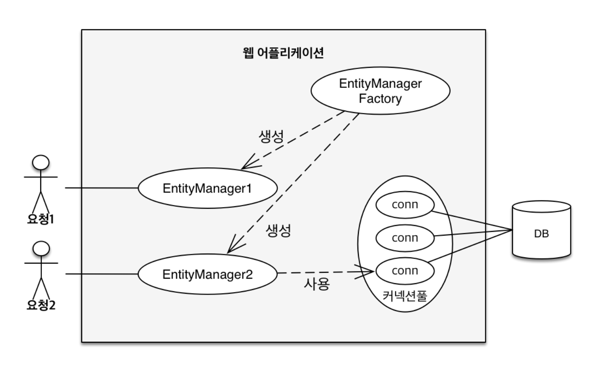
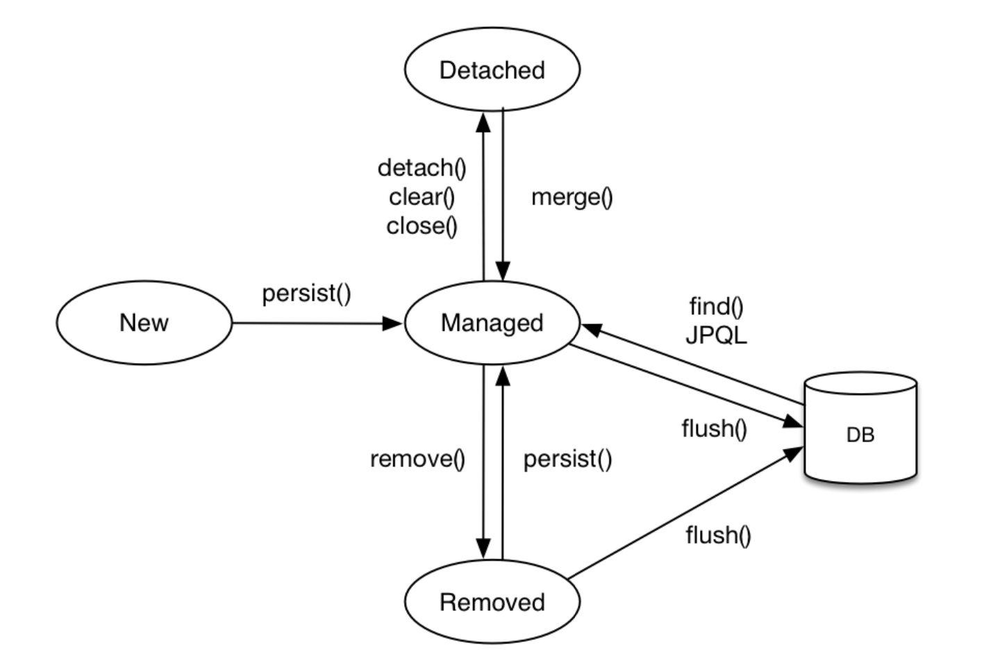

# 영속성 관리

> 엔티티 매니저와 엔티티 매니저 팩토리에 역할을 알고  JPA에서 영속성 컨텍스트에 동작 방식에 대해 배운다. 

 

 

## 엔티티 매니저와 엔티티 팩토리

**엔티티 매니저 팩토리** : 사용자에게 요청이 올때마다 엔티티 매니저 생성해서 할당, 

- 만드는데 비용이 큼
- 여러 스레드가 동시 접근 가능

**엔티티 매니저** : 엔티티를 저장하고 수정하고 삭제하는 등 엔티티와 관련된 모든일을 처리

- 만드는데 비용이 작음
- 여러 스레드 동시 접근시 동시성 문제 발생

 

 

## 영속성 컨텍스트

-> **엔티티를 영구 저장하는 환경**

엔티티를 저장하거나 조회하면 엔티티 매니저는 영속성 컨텍스트에 엔티티를 보관

컨텍스트 (context) -> 어떤한 행위를 할때 필요한 정보

 

#### 엔티티에 4가지 상태 ( 생명주기 )

- 비영속 : 영속성 컨텍스트와 전혀 관계가 없는 상태
- 영속 : 영속성 컨텍스트에 저장된 상태
- 준영속 : 영속성 컨텍스트에 저장되었다가 분리된 상태
- 삭제 : 삭제된 상태

 

#### 영속성 컨텍스트의 특징

- 영속성 컨텍스트는 엔티티를 식별자 값으로 구분 따라서 영속상태에는 식별자 값이 반드시 있어야 한다.
- 트랜잭션에 커밋하는 순간 영속성 컨텍스트에 새로 저장된 엔티티를 DB에 저장 -> 플러시

#### 영속성 컨텍스트를 통해 얻는 장점

- 1차 캐시 
  - 영속성 컨텍스트는 1차 캐시에 엔티티를 저장하고 조회한다.

- 동일성 보장
  - 조회시 1차캐시에서 엔티티를 가져오기에 동일성을 보장한다. 

- 트랜잭션을 지원하는 쓰기 지연
- 변경 감지
- 지연 로딩

 

#### 플러시

-> 영속성 컨텍스트의 변경 내용을 데이터베이스에 반영하는것

**동장 방식**

1. 영속성 컨테스트에 있는 엔티티가 수정 되었으면 수정 쿼리를 만들어 sql 저장소에 등록
2. 쓰기 지연 sql 저장소의 쿼리를 데이터 베이스에 전송

**플러시 하는 방법**

1. 직접 호출
2. 트랜잭션 커밋 시 자동 호출
3. jpql 쿼리 실행 시 플러시 자동 호출
